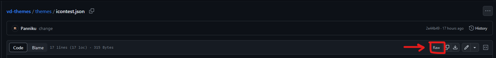

# Theme Docs [IN PROGRESS]

# Contents

- [Introduction](#introduction)
  - [Making and loading a theme](#making-and-loading-a-theme)
  - [Editing the theme](#editing-the-theme)
- [Documentation](#documentation)

## Introduction

This documentation provides a basic overview for making themes for Vendetta.  
It is based on [Vodka's Theme doc, with updated colors and keys](https://vodkamartini.notion.site/vodkamartini/Vendetta-Theme-Docs-b240b7d7a1dd4120933d7f7679265c42)

---

## 1. Making and loading a theme

It is recommended to at least know how json works, as well as looking at other theme sources.

Make a new .json file (example, `mytheme.json`)  
Then copy paste this template

```json
{
  "name": "My Theme",
  "description": "My new theme!",
  "authors": [
    {
      "name": "You!",
      "id": "YOUR_ID"
    }
  ],
  "semanticColors": {},
  "rawColors": {},
  "spec": 2
}
```

`name` - Name of the theme  
`description` - Description of the theme  
`authors` - Array of authors contributing to the theme  
`semanticColors` - Most "primary" colors  
`rawColors` - Most "secondary" colors  
`spec` - Specification value. Required for Vendetta to load the theme. This value is required to be at 2.

Now, go to github, and make a new repository  
Place your theme.json in that repository and click on it  
Then, click the "raw" option:
  
Copy the url.

Now, go to Vendetta, into Themes section  
Click on the "Add Themes" button (top right) and paste the url.  
Your theme should now be loaded!

# 2. Editing the theme

This is the fun part!  
As an example, we will be changing the chat background color.

### Chat Background

The key for the chat background is `CHAT_BACKGROUND`. We wil add this key to our theme.json
In your theme.json, your `semanticColors` should look like this:

```json
"semanticColors": {},
```

We will now change it to:

```json
"semanticColors": {
    "CHAT_BACKGROUND": [
        "#000000"
    ]
},
```

Here, we make a new array `CHAT_BACKGROUND`, with a hex value  
The values for the color goes in this order:

Dark  
Light  
Amoled  
Darker (?)

```json
"CHAT_BACKGROUND": [
    "#000000",
    "#FFFFFF",
    "#000000",
    "#000000"
]
```

When you save changes and update the file in your repository, go back to Vendetta and refetch the theme.

### This will take some time to update, since GitHub has to cache the updated file!

After reloading, you will see that the chat background is now black, as the hex color #000000 !

---

# Documentation

This is the documentation for all colors neccessary to make a theme.  
Some colors are yet unknown, but will be added

## [Semantic Colors](https://github.com/Panniku/vd-themes/blob/main/docs/semantic_colors.md)

These colors are mostly primary.  
Flexible, and work for both Dark, Light, Amoled (?) and Darker themes (built-in discord).

## [Raw Colors](https://github.com/Panniku/vd-themes/blob/main/docs/raw_colors.md)

These colors are like secondary.  
Mostly used for brand colors, and other colored elements

## Backgrounds
